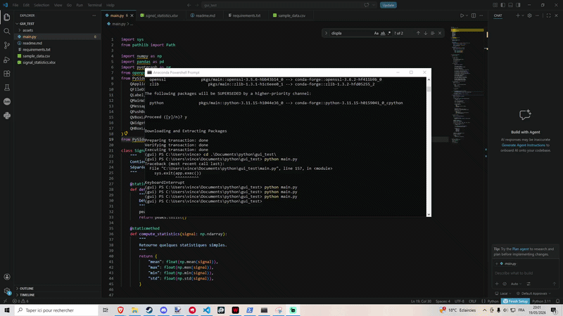

**Signal Viewer — PySide6 Desktop Application** 

Application desktop de visualisation et d’analyse de signaux temporels, développée en Python avec PySide6 et pyqtgraph.

**Objectif**  

Ce projet a pour but de simuler un outil d’analyse de signaux de type industriel :

chargement de séries temporelles (CSV)
visualisation multi-signaux
analyse statistique
détection d’événements simples
régression linéaire
export des résultats vers Excel

**Stack technique** 
Python 3.10+
PySide6 (interface graphique desktop)
pyqtgraph (visualisation interactive)
numpy (calcul scientifique)
pandas (manipulation de données)
openpyxl (export Excel)

**Installation** 

1. Créer un environnement pip
python3 -m venv /path/to/new/virtual/environment

2. Installer les dépendances
pip freeze > requirements.txt

**Lancer l’application**
python main.py

**Fonctionnalités**

1. Chargement de données
Import de fichiers CSV contenant des séries temporelles
Format attendu : Fichier CSV contenant les colonnes Time, Signal_A, Signal_B

2. Visualisation interactive
- Affichage multi-signaux
- Zoom / pan
- Grille active
- Légende dynamique
- Couleurs différentes par signal

3. Analyse des signaux
Statistiques :
- moyenne
- min / max
- écart-type
- Détection d’événements simples (seuil)

4. Régression linéaire

Pour chaque signal :
- calcul d’une régression linéaire (numpy polyfit)
- affichage de la droite associée
- comparaison visuelle des tendances

5. Export Excel

- Génération automatique d’un fichier .xlsx
- Résumé statistique par signal

**Architecture du fichier python**
```text
main.py
│
├── UI (MainWindow)
│   ├── gestion des événements
│   ├── chargement fichiers
│   ├── affichage graphique
│
├── SignalAnalyzer
│   ├── calculs statistiques
│   ├── détection de pics
│   ├── régression
│
└── Export Excel
    └── openpyxl
```

**Aperçu**
